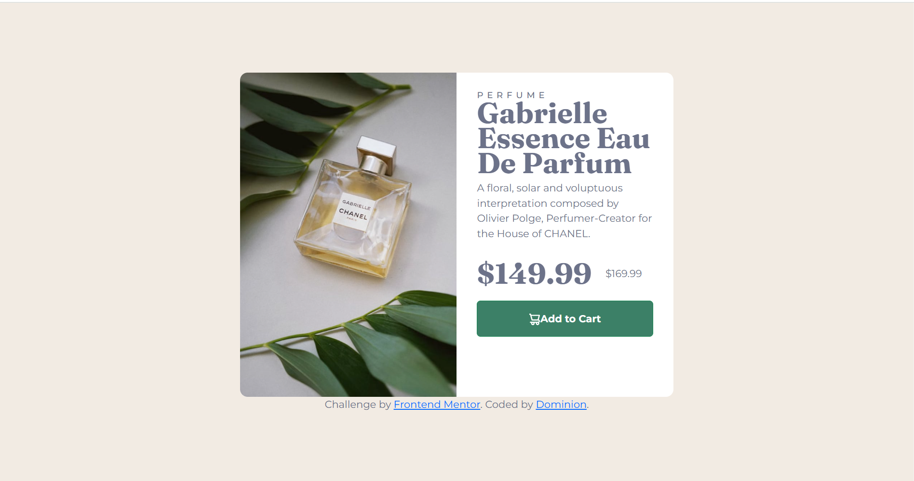
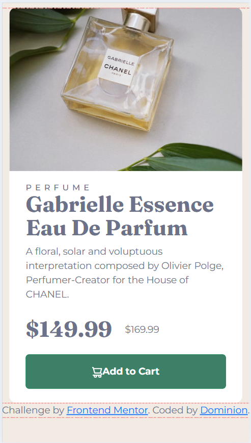

# Frontend Mentor - Product preview card component solution

This is a solution to the [Product preview card component challenge on Frontend Mentor](https://www.frontendmentor.io/challenges/product-preview-card-component-GO7UmttRfa). Frontend Mentor challenges help you improve your coding skills by building realistic projects. 

## Table of contents

- [Overview](#overview)
  - [The challenge](#the-challenge)
  - [Screenshot](#screenshot)
  - [Links](#links)
- [My process](#my-process)
  - [Built with](#built-with)
  - [What I learned](#what-i-learned)
  - [Continued development](#continued-development)
  - [Useful resources](#useful-resources)
- [Author](#author)
- [Acknowledgments](#acknowledgments)

## Overview

### The challenge

Users should be able to:

- View the optimal layout depending on their device's screen size
- See hover and focus states for interactive elements

### Screenshot

### Links

- Solution URL: [https://github.com/why-not-phoenix/product-preview-card-2](https://github.com/why-not-phoenix/product-preview-card-2)
- Live Site URL: [https://why-not-phoenix.github.io/product-preview-card-2/](https://why-not-phoenix.github.io/product-preview-card-2/)

## My process

### Built with

- Semantic HTML5 markup
- CSS custom properties
- Flexbox
- CSS Grid
- Mobile-first workflow
- Bootstrap

### What I learned

This wasn't a particularly difficult challenge, although for whatever reason it took to more time than I expected to complete. Was my first time really diving deep into Bootstrap and I often found myself doing some things myself rather than using Bootstrap. I had to look up some pages for responsiveness and chatgpt was my friend when I had things seemingly not work well. Some it helped with while others I had to figure out myself.
I guess what took the most time was trying to perfect the dimensions, which I still don't think I got right. I think going forward, I'd not bother too much on making my dimensions exactly as in the design but instead focus more on getting the design in itself right. Hopefully my OCD allows this.
All things considered, I guess I am improving everyday.
If you've read this far then, wel thanks for indulging me.

### Useful resources

- [https://web.dev/learn/design/picture-element](https://web.dev/learn/design/picture-element) - This helped recap my knowledge on responsive images.

## Author

- Frontend Mentor - [@why-not-phoenix](https://www.frontendmentor.io/profile/why-not-phoenix)
- Twitter - [@dominion_onoja](https://x.com/dominion_onoja?t=RAWgmHy3YlUySDiPDnZS2g&s=09)

## Acknowledgments

Frontend Mentor Learning paths and ChatGPT
